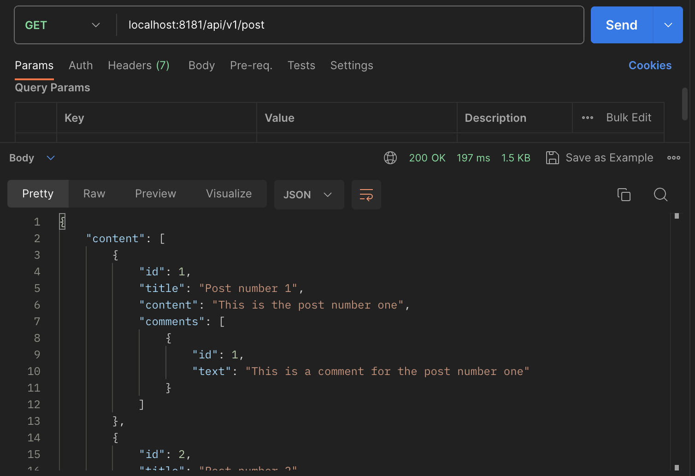
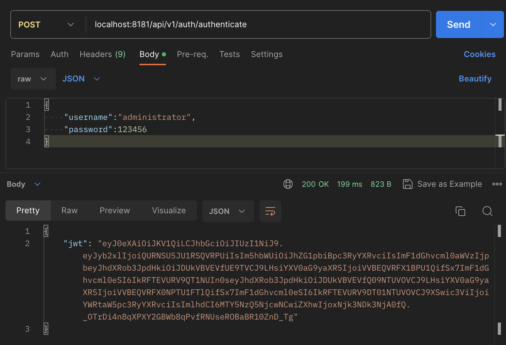
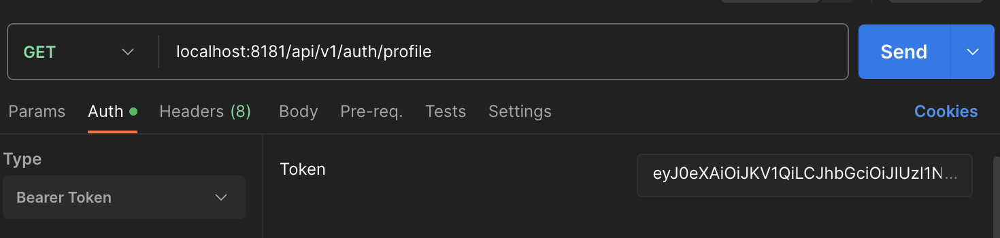
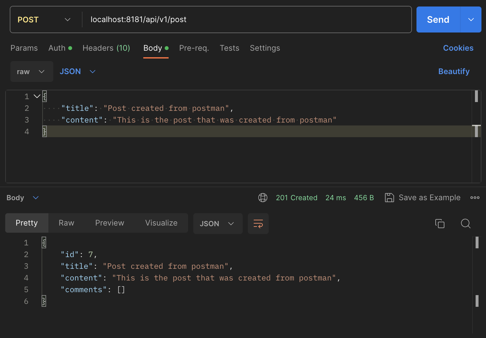

# API Blog App

## Description: This API allow users to create, read, update and delete blog posts and comments. Also have an authentication system that supports login and signup, which uses JWT.

## Tools

*     Spring boot
*     Java 17
*     lombok
*     JWT
*     springdoc

## How to deploy the API

* Clone the project: git clone https://github.com/jhecohe/blog-api.git
* cd blog-api
* mvn spring-boot:run
* The base API URL is: localhost:8181/api/v1

## How to use

The application load data for default for make easier to test the API, post, comments and 3 users with the 3 roles that allow the application, the roles are the following:

* 	ADMINISTRATOR
* 	EDITOR
* 	FOLLOWER

The users preload have the role name as username in lowercase, for example the user with the role ADMINISTRATOR his username is administrator. the password is the same for everyone "123456"

This link containt the collection in postman to execute the different endpoints [https://www.postman.com/jhecohe/workspace/blog-api/collection/3618312-f568fec2-cacf-4248-9a22-50ddccf8bc63?action=share&creator=3618312 ]()

The different endpoints availbles in the API are documented in the following link http://localhost:8181/api/v1/swagger-ui/index.html

### Get posts
To get the post created we just need to execute the following enpoint

`GET: localhost:8181/api/v1/post`

### Login and get the Json Web Token
To login we required to send the username and password to the next end point:

`POST: localhost:8181/api/v1/auth/authenticate`

`{
    "username":"administrator",
    "password":123456
}`

The response is the token with the authorizations and permissions

### Information user logged
We can get the information of the user logged with the following endpoint

`GET: localhost:8181/api/v1/auth/profile `

~~~{
    "id": 1,
    "username": "administrator",
    "name": "admin istrator",
    "password": "$2a$10$m/2OHMbkRRNwquz3.Z7.QObkKZw/0GKViCIGjv6Hgr6mbps2dQ6iW",
    "role": "ADMINISTRATOR",
    "enabled": true,
    "accountNonExpired": true,
    "accountNonLocked": true,
    "credentialsNonExpired": true,
    "authorities": [
        {
            "authority": "CREATE_POST"
        },
        {
            "authority": "UPDATE_POST"
        },
        {
            "authority": "DELETE_POST"
        },
        {
            "authority": "CREATE_COMMENT"
        },
        {
            "authority": "UPDATE_COMMENT"
        },
        {
            "authority": "DELETE_COMMMENT"
        }
    ]
} 
~~~

  
### Create post

To create a new post we need to be already authenticated to send the token in the request.

`POST: localhost:8181/api/v1/post `

`{
    "title": "Post created from postman",
    "content": "This is the post that was created from postman"
}`

